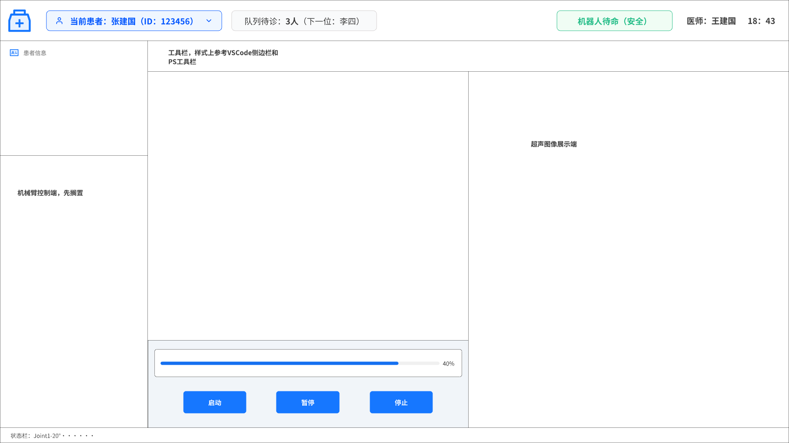

# RUS-Sim 超声机器人仿真平台前端

## 项目简介

RUS-Sim（Robotic Ultrasound Simulator）是一个面向超声扫查机械臂的数字孪生仿真平台，旨在为自动化扫查算法和AI辅助诊断模块的研发提供安全、可控的集成验证环境。

## 前端开发环境搭建

### 系统环境要求

- 操作系统：**Windows 10/11**
- 开发环境：**Godot 4.6+**
- 脚本语言：**.NET SDK 8.0+**

### 插件要求

- **godot-git-plugin**：3.2.1
- **godot-webview**

### 第三方依赖

- OpenCVSharp4：4.13.0
- OpenCvSharp4.runtime.win：4.13.0
- OpenCvSharp4.official.runtime.linux-x64：4.13.0
- Microsoft.Data.Sqlite：10.0.5
- sqlite-net-pcl：1.9.172
- SQLitePCLRaw.bundle_e_sqlite3：3.0.2

## 项目结构

```
project/
├── project.godot              # 项目配置文件
├── README.md                  # README 文件
├── addons/                    # 插件（自行创建并将插件安装到该文件夹下）
│   ├── godot-git-plugin/      # git 插件，资产库内可找到
│   └── webview/               # webview 插件，需自行安装
├── assets/                    # 资源（模型，图标等）
│   ├── robot_description/     # 机械臂模型资源
│   └── ...                  
├── docs/                      # 开发文档文件夹
│   └── README.md
├── scenes/                    # 场景文件夹
│   ├── main.tscn              # 主场景
│   ├── Robot/                 # 机械臂模块
│   └── UI/
│       ├── ui_main.tscn       # UI 主场景
│       ├── UltrasoundImage/   # 超声图像 UI 控件
│       ├── RobotControl/      # 机械臂控制 UI 控件
│       ├── Information/       # 病人与医生信息展示控件
│       ├── ToolBar/           # 工具栏控件
│       └── ...
└── src/                       # 脚本代码 C#
	├── Communication/         # 后端交互模块
	├── Robot/                 # 机械臂模块
	├── UltrasoundImage/       # 超声图像处理模块
	├── UI/                    # UI 控制脚本
	└── ...
```

## 主界面示例



## 主要模块说明

### Information 模块

- 显示病人基础信息
- 显示医生信息
- 查找病人信息

### 机械臂模块

- 在3D场景中展示机械臂模型
- 实时显示机械臂关节角度、末端位置/姿态
- 提供控制面板（手动/自动运动，紧急停止）
- 接收后端数据并更新模型状态

### 超声图像模块

- 实时显示超声图像（来自后端视频流或图片序列）
- 图像处理功能：对比度/亮度调节、测量（距离、面积）、标注（文字、箭头）
- 支持图像冻结、保存、回放

## 开发规范

- [Godot 开发规范](./DevelopmentGuide.md)
